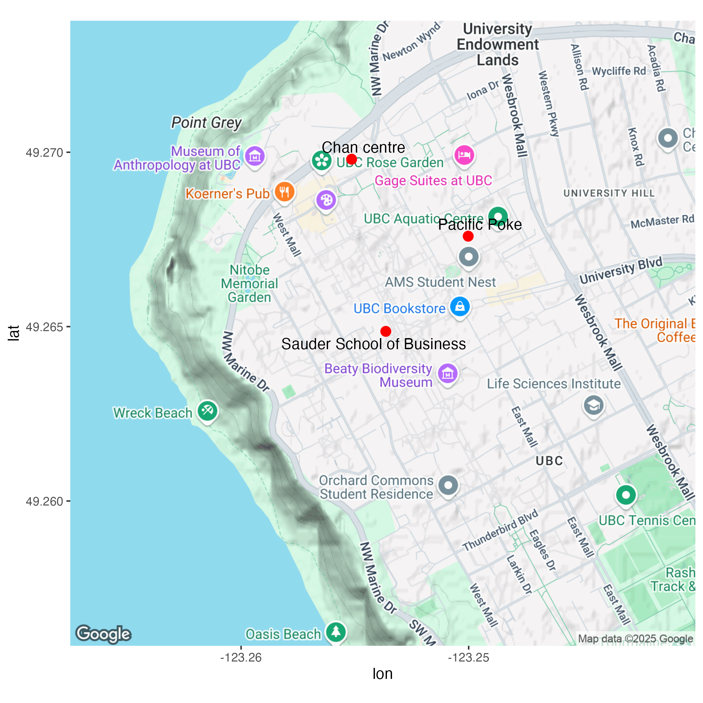

```{r setup, include=FALSE}
knitr::opts_chunk$set(echo = TRUE, warning = FALSE, message = FALSE, comment = NA, fig.asp = 0.56, out.width = "70%", dpi = 300, fig.align = "center")
options(tibble.print_max = Inf)
library(kableExtra)
```

Google API registration

Stadia Maps API registration

geocode

get_map

ggmap

baselayer

facet_wrap

---

### Google API registration

1. Go to https://developers.google.com/maps/get-started/ and press 'GET STARTED' button or follow the Steps 1-3.
1. Create billing account. (You will need a credit card.)
1. Create a project - COMM 407 on the project selector page.
1. Enable the following APIs - Geocoding, Maps Static on the Maps Library page.
1. Create and save the API key, on the Credentials page.  
1. Start the free trial.

---

### Stadia Maps

1. Sign up at https://client.stadiamaps.com/signup/
1. Obtain your API key by following the instruction at https://docs.stadiamaps.com/authentication/ or https://youtu.be/6jUSyI6x3xg.
     1. You can use 'COMM407' (or any string you like) as your property name.

---

```{r}
library(ggmap)
library(tidyverse)
```

```{r eval=FALSE}
register_google("Your Google API key", write = TRUE)
register_stadiamaps("Your Stadia Maps API key", write = TRUE)
```

---

Suppose we want to show the following locations on a Google map background: Chan centre, 2053 main mall Vancouver, Pacific Poke.

```{r echo=FALSE}

```

---

We need

- the Google map background for UBC - ggmap::get_map().

- the coordinate (longitude and latitude) for the locations - geocoding - ggmap::mutate_geocode().

---


### Geocoding

.small[
```{r}
tb <- tibble(
  label = c("Sauder School of Business", "Pacific Poke", "Chan centre"),
  address = c("2053 main mall Vancouver", "Pacific Poke UBC", "Chan centre")
)

tb
```
]

---

```{r }
tb <- tb %>% mutate_geocode(address)

tb
```

---

```{r}
ggplot(tb) +
  geom_point(aes(lon, lat))
```

---

```{r }
ubcmap <- get_map("University of British Columbia Vancouver")
```

```{r}
ggmap(ubcmap)
```

---

```{r}
ubcmap <- get_map("Sauder School of Business", zoom = 15)
```

```{r}
ggmap(ubcmap) + geom_point(aes(lon, lat), tb, color = "red", size = 3)
```

---

```{r}
ggmap(ubcmap) + geom_point(aes(lon, lat), tb, color = "red", size = 3) +
  ggrepel::geom_text_repel(aes(lon, lat, label = label), tb)
```

---

### base_layer

```{r}
ggmap(ubcmap, base_layer = ggplot(tb, aes(lon, lat))) +
  geom_point(color = "red", size = 3) +
  ggrepel::geom_text_repel(aes(label = label))
```

---

Practice - create the following map.

```{r echo=FALSE}
tb2 <- tibble(label = "Canada Place", address = c("999 Canada Pl")) %>%
  mutate_geocode(address)

downtown_map <- get_map("999 Canada Pl", zoom = 14)
ggmap(downtown_map, base_layer = ggplot(tb2, aes(lon, lat))) + geom_point(color = "red", size = 4, alpha = 0.7) + ggrepel::geom_text_repel(aes(label = label)) + scale_y_continuous(limits = c(49.28, 49.3))
```

---

```{r echo=params$answers, eval=FALSE}
tb2 <- tibble(label = "Canada Place", address = c("999 Canada Pl")) %>%
  mutate_geocode(address)

downtown_map <- get_map("999 Canada Pl", zoom = 14)
ggmap(downtown_map, base_layer = ggplot(tb2, aes(lon, lat))) +
  geom_point(color = "red", size = 4, alpha = 0.7) +
  ggrepel::geom_text_repel(aes(label = label)) +
  scale_y_continuous(limits = c(49.28, 49.3))
```

---

### Map type

```{r eval=FALSE}
? get_map
```

get_map(location = c(lon = -95.3632715, lat = 29.7632836),
  zoom = "auto", scale = "auto", maptype = c("terrain",
  "terrain-background", "satellite", "roadmap", "hybrid", "toner",
  "watercolor", "terrain-labels", "terrain-lines", "toner-2010",
  "toner-2011", "toner-background", "toner-hybrid", "toner-labels",
  "toner-lines", "toner-lite"), source = c("google", "osm", "stamen"),
  force = ifelse(source == "google", TRUE, FALSE), messaging = FALSE,
  urlonly = FALSE, filename = NULL, crop = TRUE, color = c("color",
  "bw"), language = "en-EN", ...)

---

.tiny[
```{r }
ubcmap_2 <- get_map("Sauder School of Business", zoom = 15, maptype = "roadmap")
ggmap(ubcmap_2)
```
]

---

.small[
```{r }
ubcmap_stamen <- get_map("Sauder School of Business",
  maptype = "stamen_toner_lite",
  zoom = 15, source = "stadia"
)
ggmap(ubcmap_stamen)
```
]


---

```{r}
ggmap(ubcmap_stamen, base_layer = ggplot(tb, aes(lon, lat))) +
  geom_point(color = "red", size = 3) +
  ggrepel::geom_text_repel(aes(label = label))
```

---

### theme_void()

.small[
```{r}
ggmap(ubcmap_stamen, base_layer = ggplot(tb, aes(lon, lat))) +
  geom_point(color = "red", size = 3) +
  ggrepel::geom_text_repel(aes(label = label)) + theme_void()
```
]

---

Practice - create this map.

```{r echo=FALSE}
tb2 <- tibble(label = "Canada Place", address = c("999 Canada place")) %>%
  mutate_geocode(address)

downtown_map2 <- get_map("999 Canada place", zoom = 14, source = "stadia", maptype = "stamen_toner_lite")

ggmap(downtown_map2, base_layer = ggplot(tb2, aes(lon, lat))) +
  geom_point(color = "red", size = 4, alpha = 0.7) +
  ggrepel::geom_text_repel(aes(label = label), color = "red") +
  scale_y_continuous(limits = c(49.28, 49.3)) +
  theme_void()
```

---

.small[
```{r echo=params$answers, eval=FALSE}
tb2 <- tibble(label = "Canada Place", address = c("999 Canada place")) %>%
  mutate_geocode(address)

downtown_map2 <- get_map("999 Canada place", zoom = 14, source = "stadia", maptype = "stamen_toner_lite")

ggmap(downtown_map2, base_layer = ggplot(tb2, aes(lon, lat))) +
  geom_point(color = "red", size = 4, alpha = 0.7) +
  ggrepel::geom_text_repel(aes(label = label), color = "red") +
  scale_y_continuous(limits = c(49.28, 49.3)) +
  theme_void()
```
]


---

Practice - show the most expensive 300 transactions in year 2019 in the BCA data set on a map.

```{r eval=FALSE}
bca_top300 <- read_rds("Data/bca252.rds") %>%
  filter(lubridate::year(sale_date) == 2019) %>%
  slice_max(price, n = 300)
```

```{r echo=FALSE}
bca_top300 <- read_rds("../Data/bca252.rds") %>%
  filter(lubridate::year(sale_date) == 2019) %>%
  slice_max(price, n = 300)
```

---

```{r echo=FALSE}
vanmap2 <- get_map("Surrey Canada",
  zoom = 10,
  source = "stadia", maptype = "stamen_toner_lite"
)

ggmap(vanmap2) +
  geom_point(aes(lon, lat), bca_top300, color = "red", alpha = 0.3) +
  scale_y_continuous(limits = c(49, 49.35)) +
  theme_void()
```

---

```{r echo=params$answers, eval=FALSE}
vanmap2 <- get_map("Surrey Canada",
  zoom = 10,
  source = "stadia", maptype = "stamen_toner_lite"
)

ggmap(vanmap2) +
  geom_point(aes(lon, lat), bca_top300, color = "red", alpha = 0.3) +
  scale_y_continuous(limits = c(49, 49.35)) +
  theme_void()
```

