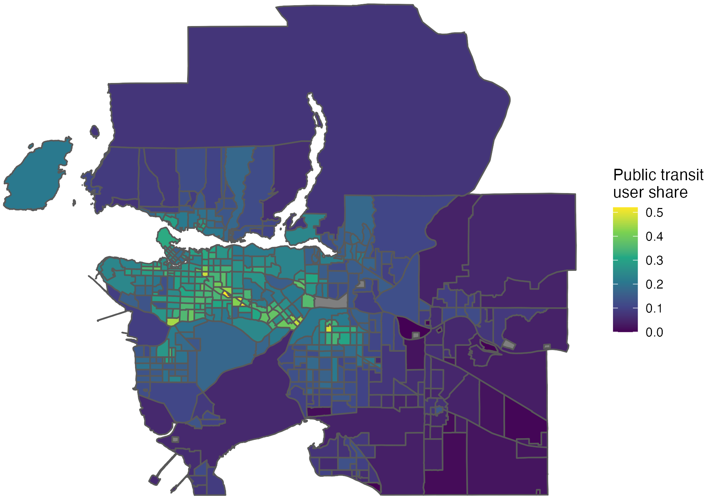
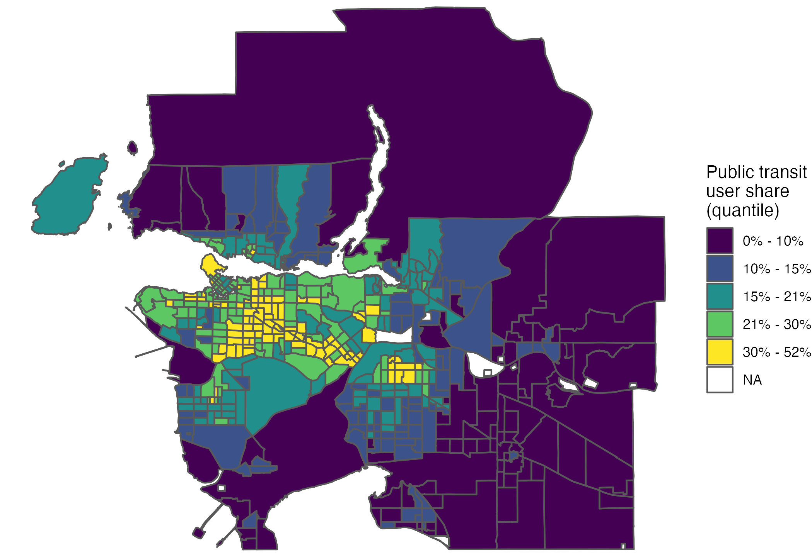

```{r setup, include=FALSE}
knitr::opts_chunk$set(echo = TRUE, warning = FALSE, message = FALSE, comment=NA, fig.asp = 0.56, out.width='85%', dpi = 300, fig.align = 'center')
# options(tibble.print_max = Inf)
library(kableExtra)
```

.center[
```{r echo=FALSE, out.width='80%'}

```
]

---

.vertical-center[
```{r echo=FALSE, out.width='80%'}

```
]

---

```{r eval=FALSE}
install.packages("devtools")
devtools::install_github("sleeubc/sanghoon")
```

---

```{r}
library(tidyverse)
library(sf)
library(sanghoon)
```

---

```{r}
library(cancensus)
tb_public_transit <- get_census("CA16", 
                                c("v_CA16_5792","v_CA16_5801"), 
                                regions = list(CMA = "59933"), 
                                level = "CT", 
                                geo_format = "sf")
```


---

.tiny[
```{r}
tb_public_transit <- tb_public_transit %>% transmute(
  pub_tr_sh=`v_CA16_5801: Public transit` / `v_CA16_5792: Total - Main mode of commuting for the employed labour force aged 15 years and over in private households with a usual place of work or no fixed workplace address - 25% sample data`)
```
]

.scroll-output[
.tiny[
```{r echo=FALSE}
tb_public_transit %>% head(30) %>% kable
```
]]

---

.tiny[
```{r}
  ggplot(tb_public_transit) + geom_sf(aes(fill = pub_tr_sh)) + 
  scale_fill_viridis_c(name="Public transit\nuser share") + theme_void()
```
]

---

.tiny[
```{r}
tb_public_transit %>% mutate(pub_tr_sh_d = pub_tr_sh %>% classify(5)) %>% 
  ggplot() + geom_sf(aes(fill = pub_tr_sh_d)) + 
  scale_fill_viridis_d(name="Public transit\nuser share", na.value = "darkgrey") + theme_void()
```
]

---

```{r eval=FALSE}
tb_public_transit %>% mutate(pub_tr_sh_d = pub_tr_sh %>% classify(5))
```

.scroll-output[
.tiny[
```{r echo=FALSE}
tb_public_transit %>% mutate(pub_tr_sh_d = pub_tr_sh %>% classify(5)) %>% head(30) %>% kable
```
]]

---

.tiny[
```{r}
tb_public_transit %>% mutate(
  pub_tr_sh_d = pub_tr_sh %>% classify(5, label=scales::label_number(accuracy = 0.1, scale = 100, suffix = "%"))) %>% 
  ggplot() + geom_sf(aes(fill = pub_tr_sh_d)) + 
  scale_fill_viridis_d(name="Public transit\nuser share", na.value = "darkgrey") + theme_void()
```
]

---

.tiny[
```{r}
tb_public_transit %>% mutate(
  pub_tr_sh_d = pub_tr_sh %>% classify(5, style="quantile", label=scales::label_number(accuracy= 0.1, scale = 100, suffix = "%"))) %>% 
  ggplot() + geom_sf(aes(fill = pub_tr_sh_d)) + 
  scale_fill_viridis_d(name="Public transit\nuser share\n(quantile)", na.value = "darkgrey") + theme_void()
```
]

---

.tiny[
```{r}
tb_public_transit %>% mutate(
  pub_tr_sh_d = pub_tr_sh %>% classify(5, style="jenks", label=scales::label_number(accuracy=0.1, scale = 100, suffix = "%"))) %>% 
  ggplot() + geom_sf(aes(fill = pub_tr_sh_d)) + 
  scale_fill_viridis_d(name="Public transit\nuser share\n(Jenks natural break)", na.value = "darkgrey") + theme_void()
```
]

---

#### Create this map
```{r echo=FALSE}
tb_public_transit %>% mutate(
  pub_tr_sh_d = pub_tr_sh %>% classify(4, style="jenks", label=scales::label_number(accuracy=0.1, scale = 100, suffix = "%"))) %>% 
  ggplot() + geom_sf(aes(fill = pub_tr_sh_d)) + 
  scale_fill_viridis_d(name="Public transit\nuser share\n(Jenks natural break)", na.value = "darkgrey") + theme_void()
```

---

.small[
```{r eval=FALSE}
tb_public_transit %>% mutate(
  pub_tr_sh_d = pub_tr_sh %>% classify(4, style="jenks", 
  	label=scales::label_number(accuracy=0.1, scale = 100, suffix = "%"))
  ) %>% 
  ggplot() + geom_sf(aes(fill = pub_tr_sh_d)) + 
  scale_fill_viridis_d("Public transit\nuser share\n(Jenks natural break)", 
  										 na.value = "darkgrey") + 
	theme_void()
```
]

---


### ColorBrewer

https://colorbrewer2.org/

---

.tiny[
```{r}
tb_public_transit %>% mutate(
  pub_tr_sh_d = pub_tr_sh %>% classify(5, style="jenks", label=scales::label_number(accuracy=0.1, scale = 100, suffix = "%"))) %>% 
  ggplot() + geom_sf(aes(fill = pub_tr_sh_d)) + 
  scale_fill_brewer(name="Public transit\nuser share\n(Jenks natural break)", palette = "YlOrBr", na.value = "darkgrey") + theme_void()
```
]

---

### Creats this map

```{r echo=FALSE}
tb_public_transit %>% mutate(
  pub_tr_sh_d = pub_tr_sh %>% classify(5, style="jenks", label=scales::label_number(accuracy=0.1, scale = 100, suffix = "%"))) %>% 
  ggplot() + geom_sf(aes(fill = pub_tr_sh_d)) + 
  scale_fill_brewer(name="Public transit\nuser share\n(Jenks natural break)", palette = "Blues", na.value = "darkgrey") + theme_void()
```

---

.tiny[
```{r eval=FALSE}
tb_public_transit %>% mutate(
  pub_tr_sh_d = pub_tr_sh %>% classify(5, style="jenks", label=scales::label_number(accuracy=0.1, scale = 100, suffix = "%"))) %>% 
  ggplot() + geom_sf(aes(fill = pub_tr_sh_d)) + 
  scale_fill_brewer(name="Public transit\nuser share\n(Jenks natural break)", palette = "Blues", na.value = "darkgrey") + theme_void()
```
]

---

.tiny[
```{r}
tb_public_transit %>% mutate(
  pub_tr_sh_d = pub_tr_sh %>% classify(5, style="jenks", label=scales::label_number(accuracy=0.1, scale = 100, suffix = "%"))) %>% 
  ggplot() + geom_sf(aes(fill = pub_tr_sh_d)) + 
  scale_fill_brewer(name="Public transit\nuser share\n(Jenks natural break)", palette = "YlOrBr", na.value = "darkgrey") + theme_void() +
  theme(legend.key.size = unit(0.5, "cm"), legend.position = c(0.05, 0.25))
```
]

